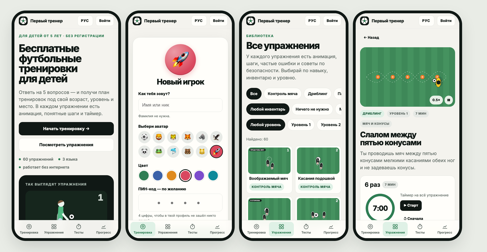

<div align="center">


# FIRST COACH · Первый тренер · Бірінші бапкер

**A free, open football school for children.**
60 drills with animations, a 4-week plan, skill tests and progress — in Kazakh, Russian and English.
No email, no passwords, works offline on a cheap phone.

[**Open the app →**](https://first-coach-production.up.railway.app) &nbsp;·&nbsp; [Русская версия](README.ru.md) &nbsp;·&nbsp; [Contributing](CONTRIBUTING.md)

[](LICENSE)
[](CONTENT-LICENSE.md)




</div>

## Mission

Every child deserves a great first coach.

Whether a child gets good coaching still depends on where they were born, whether there is an academy nearby
and whether the family can pay for it. Meanwhile a huge amount of coaching knowledge already exists — it is just
scattered and hard to reach. FIRST COACH turns that knowledge into an open system anyone can use for free:

**assess → get a plan → train → measure → improve**, from a single phone, with a ball and 3×3 metres of space.

The one number we care about: how many children demonstrably improved a skill using free, open coaching knowledge.

## What a child gets

| | |
|---|---|
| **Players** | "Who's training?" — a profile with a nickname, an avatar and an optional PIN. Siblings or a whole class can share one phone or a school tablet. Nothing leaves the device. |
| **A 4-week plan** | Five questions (age, goal, what you have, where you train, how much time) and a self-assessment across five skills. Each session fits 10–30 minutes. |
| **60 animated drills** | Ball mastery, dribbling, passing & first touch, weak foot, juggling & coordination. Each drill has an SVG animation of the technique, steps, a timer, common mistakes, safety notes and easier / harder variants. |
| **A plan that adapts** | After each drill the child says *easy / just right / hard*, and the plan levels up or down. |
| **Skill tests** | Five measurable tests with age bands; *last time 42 → today 55 (+31%)*. A skill tree and milestones — no rankings of children. |
| **Video self-check** | Film yourself, then check against the coach's checklist. The video never leaves the phone. |
| **For coaches** | A simple form to share a drill; it arrives at the team by email, already formatted. |

## Repository map

| Folder | What it is |
|---|---|
| [`lite/`](lite) | **The app that is live today.** Plain HTML, CSS and JavaScript — no framework, no build step, ~140 KB gzipped. |
| [`config/commons/football`](config/commons/football) | **Open Sport Commons**: the skill graph, 60 drills, 5 tests and video rubrics, each in Kazakh, Russian and English. |
| [`apps/api`](apps/api), [`apps/web`](apps/web) | The full platform in development: accounts, server-side moderation, the AI planner and the AI video coach (Bun, Hono, React). |
| [`docs/`](docs) | Operations runbook and screenshots. |

## Two open parts

FIRST COACH is open in two separate ways, with two licences.

- **FIRST COACH software** (the PWA, the API and the tooling) is licensed
  under the MIT licence. See [LICENSE](LICENSE).
- **Open Sport Commons** is the open, versioned knowledge base of skills and
  drills that the software teaches from. It is licensed under CC BY-SA 4.0.
  See [CONTENT-LICENSE.md](CONTENT-LICENSE.md).

## Run locally

### The app (`lite/`)

Any static web server works:

```bash
cd lite
python3 -m http.server 8080
```

Open http://localhost:8080. After editing the drills in `config/commons/football`, rebuild the app's data:

```bash
python3 lite/build_data.py
```

In production the root [`Dockerfile`](Dockerfile) copies `lite/` into the image and sets `WEB_DIST=/app/lite`,
so the API server serves it at `/`.

### The full platform (`apps/`)

Requirements: [Bun](https://bun.sh) 1.4 or newer.

```bash
bun install
cp .env.example .env
bun run dev
```

The API listens on port 4111 and serves everything under `/api`, plus `/health`.
The web dev server proxies `/api` and `/health` requests to it, so you only open
the web dev server in your browser.

An OpenAI key in `.env` is optional. The product works with the LLM off; the
key only enables the AI-assisted features: the AI planner that personalises
today's session, the drill explainer and the Beta AI Video Coach. Set
`OPENAI_API_KEY`, and optionally `OPENAI_MODEL` (text, default `gpt-4o-mini`)
and `OPENAI_VISION_MODEL` (video, default the text model). The AI planner only
picks from drills the server has already chosen, and when it fails the player
gets the ordinary rule-based session.

Operating a deployment (Railway, backups, admin accounts, takedown requests) is
described in [docs/runbook.md](docs/runbook.md). Tests: `bun test`.

## Use the commons in another app

The commons is plain data you can build on:

- The JSON files in [`config/commons/football`](config/commons/football) (skill graph, drills, tests, rubrics).
- The ready-made bundle [`lite/commons.json`](lite/commons.json), also served at
  `https://first-coach-production.up.railway.app/commons.json`.
- On the full platform: `GET /api/commons/export.json` and its JSON Schema at `GET /api/commons/schema.json`.

Carry the attribution line from [CONTENT-LICENSE.md](CONTENT-LICENSE.md) in your app, and
share your adaptations of the content under CC BY-SA 4.0 as well.

## Contribute without GitHub

You do not need GitHub or any developer skills to contribute a drill.

1. Open the app and tap **For coaches** (Тренерам / Бапкерлерге).
2. Describe the drill: what it develops, how to do it, common mistakes, how to make it easier or harder, safety.
3. Confirm that you have the right to share it under CC BY-SA 4.0.
4. Press **Send by email** — the drill goes to the team at **work@koz-ai.com**, already formatted. Attach a video or photo if you have one.

A coach reviews every drill before it appears in the app. Your authorship is kept.
Coaches who use GitHub can open a [drill proposal](../../issues/new?template=drill.yml) or a pull request — see [CONTRIBUTING.md](CONTRIBUTING.md).

## Honesty rule for AI-drafted content

The founding drills were drafted with AI. They are labelled
"FIRST COACH Community Draft" and carry the status COMMUNITY until real coaches
have reviewed them. Status badges are never hidden, so a learner can always
tell what has been reviewed by coaches and what has not. In the app every starter drill shows
*coach review: in progress* until a coach signs it off.

## No copying commercial material

Do not submit or copy FIFA, UEFA or other commercial or copyrighted material.
Contribute only what you have the right to share under CC BY-SA 4.0: your own
methods, your own videos, and your own words.

## Child safety and privacy

- No email, passwords or surnames are asked of a child; profiles and progress stay in the browser.
- No public profiles, no rankings of children, no messaging, no ads.
- Self-check videos are never uploaded.
- Every drill carries safety notes written for a child training without an adult nearby.

Found a safety or security problem? See [SECURITY.md](SECURITY.md).

## Licences

Software: MIT, see [LICENSE](LICENSE). Content: CC BY-SA 4.0, see
[CONTENT-LICENSE.md](CONTENT-LICENSE.md).

---

<div align="center">
Made in Kazakhstan by <b>KOZ AI</b> and contributors · <a href="mailto:work@koz-ai.com">work@koz-ai.com</a>
</div>
